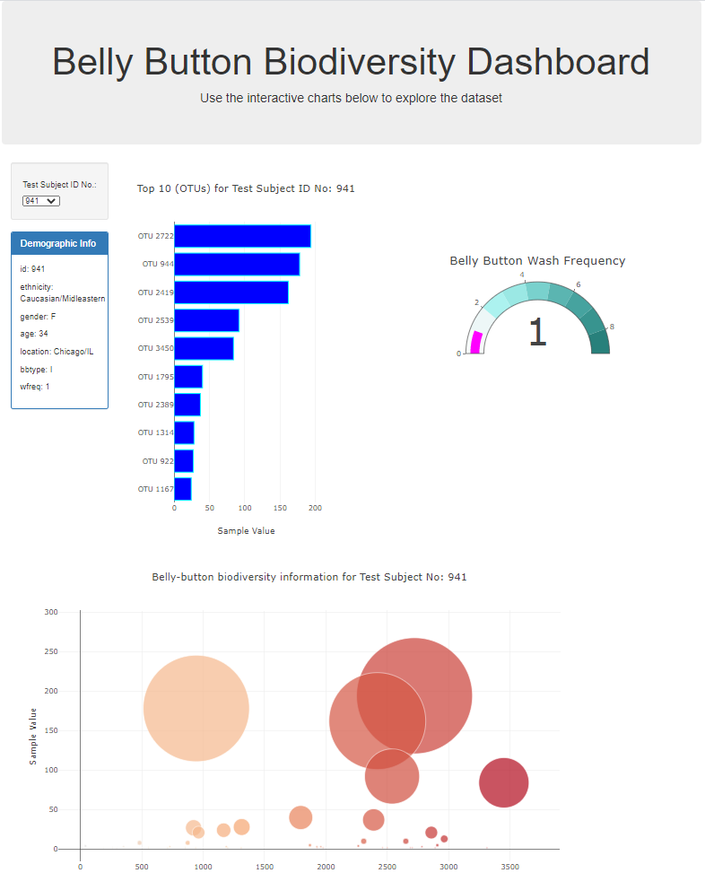

# Plotly-Challenge 

Belly Button Biodiversity - Building a Dashboard

This challenge involves building an interactive dashboard to explore the [Belly Button Biodiversity dataset](http://robdunnlab.com/projects/belly-button-biodiversity/) provided in JavaScript Object Notation (JSON) format, which catalogs the microbes that colonize human navels.

The dataset reveals that a small handful of microbial species (also called operational taxonomic units, or OTUs, in the study) were present in more than 70% of people, while the rest were relatively rare. 

Step 1: Plotly
1. The D3 library was used to read the `samples.json` file and outputed to console to have a first hand view of the dataset.
2. Bar Chart: A horizontal bar chart with a dropdown menu to display the top 10 OTUs found in each selected individual. To achieve this:
* `sample_values` data from the `samples.json` dataset was used as values for the bar chart.
* `otu_ids` was used as the labels for the bar chart.
* `otu_labels` was used as the hovertext for the chart.

  

3. Created a bubble chart that displays each sample.

* `otu_ids` was used for the x values.

* `sample_values` was used for the y values.

* `sample_values` was used for the marker size.

* `otu_ids` was used for the marker colors.

* `otu_labels` was used for the text values.

4. Displayed the sample metadata, i.e., an individual's demographic information.

5. Displayed each key-value pair from the metadata JSON object in the `Demographic Info` box on the page.

6. The dropdown `Test Subject ID No.:` will update all of the plots any time that a new sample is selected.

Additionally, the derived dashboard is shown below:

7. A Gauge Chart: A gauge chart was designed to plot the weekly washing frequency of the individual. The values were modified to account for values ranging from 0 to 9. The chart is updated whenever a new sample is selected. 

The finalized app has been deployed to github page. Click [here](https://jonathanezeugo.github.io/Plotly-Challenge/StarterCode/index.html) to view the rendered page.